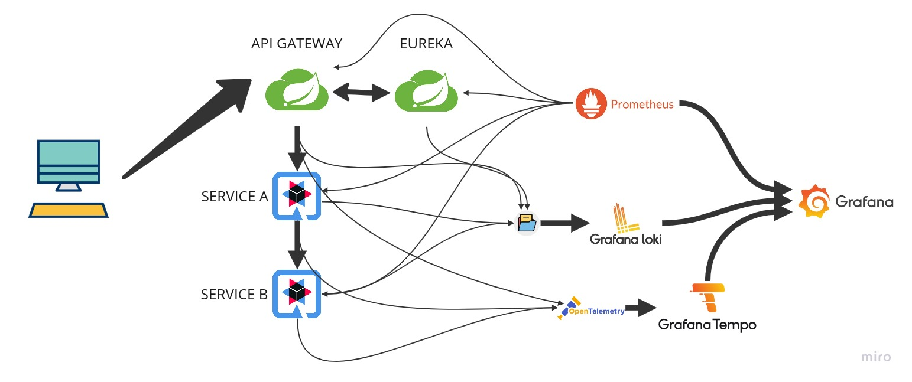

# Quarkus | Distributed Tracing example project

This project demonstrates how to use distributed tracing with Quarkus.

Related to [this blog post](https://kambei.dev/blog/it/2023-01-30-this-is-quarkus/).

## Components:

- API Gateway (Spring Cloud)
- Discovery Service - Eureka (Spring Cloud)
- Service A (Quarkus) that calls Service B
- Service B (Quarkus)

## Build images:

Run `build.sh` script to build all images.

## Run containers:

Run `docker-compose up -d` to start all containers.

## URLs:

- Discovery Service: http://localhost:8761
- API Gateway: http://localhost:8765
- Swagger: http://localhost:8765/swagger-ui.html

- Endpoint test: http://localhost:8765/test

- Prometheus: http://localhost:19090
- Grafana: http://localhost:13000

